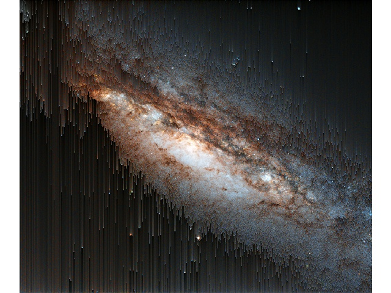

# orst
A pixel sorting program, written in python 3.x.

Based on: https://github.com/kimasendorf/ASDFPixelSort

# License

MIT

# Author

Stéphan Tulkens

# Example

## Input:

## Output:

Settings:
- criterium: Summation
- Comparer: `lambda x: x < .9`

## Image credit

ESA/Hubble - A bizarre Cosmic Rarity  
found at [Wikimedia Commons](https://commons.wikimedia.org/wiki/Category:Peculiar_galaxies#/media/File:A_bizarre_cosmic_rarity_NGC_660.jpg)
